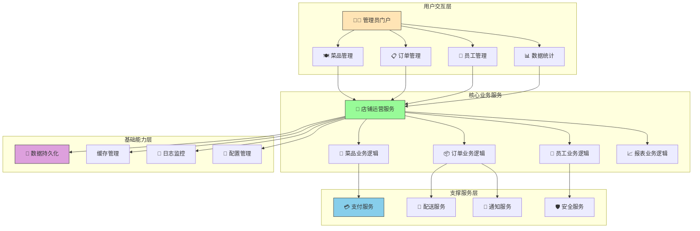
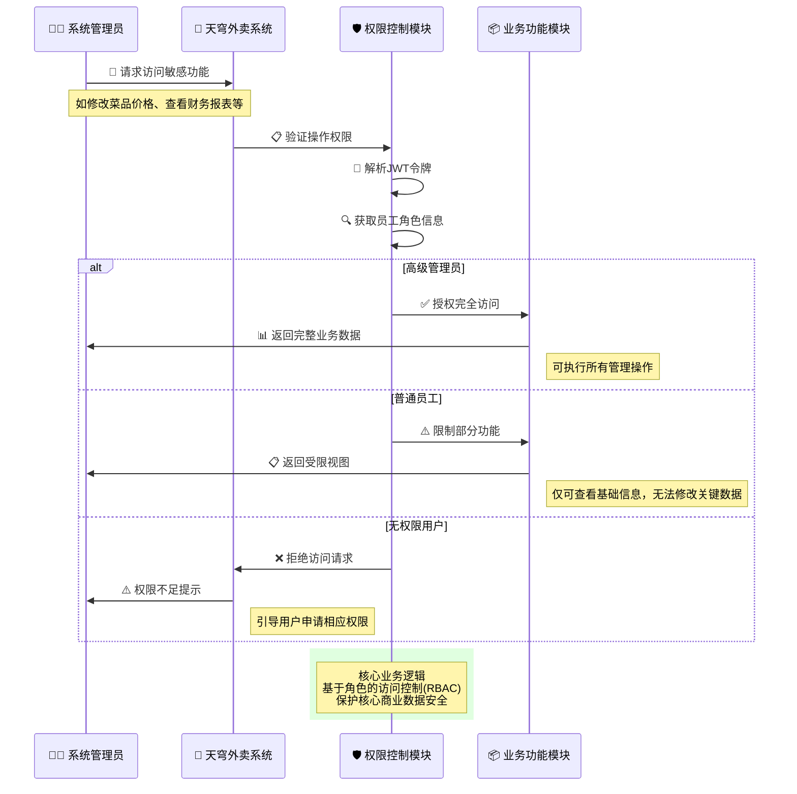
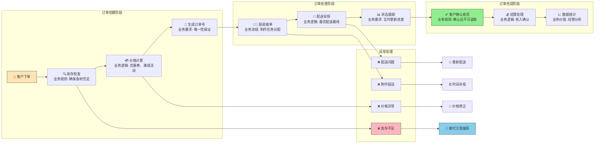
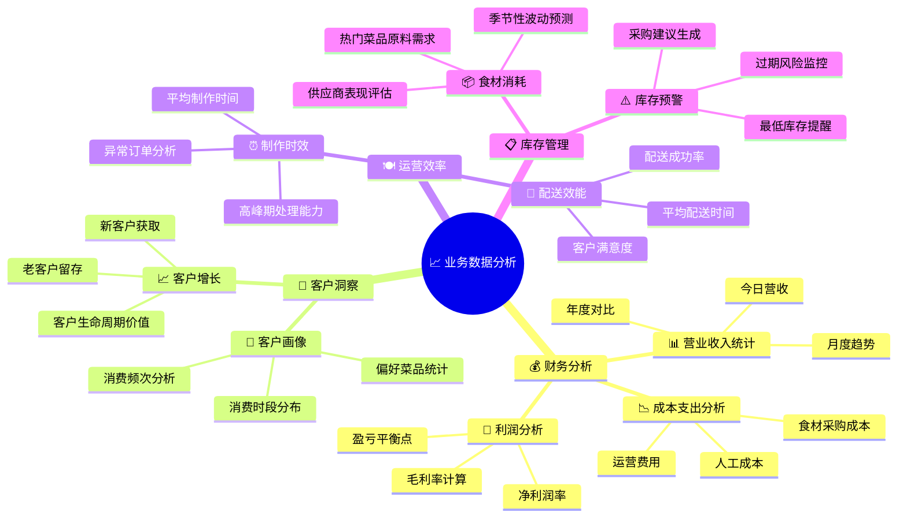
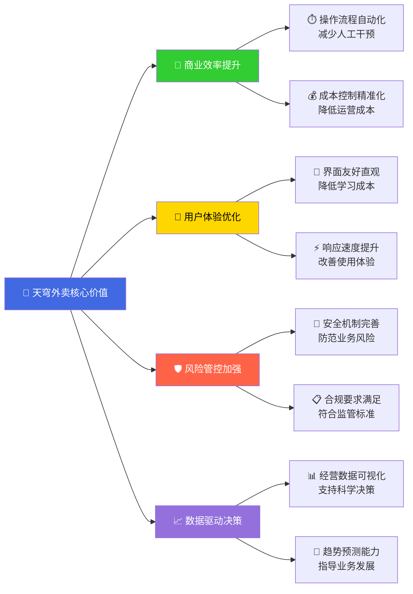

# 🎯 天穹外卖系统 - 业务逻辑导向图解

## 🏗️ 业务架构全景图



## 🚀 员工登录业务逻辑详解

```mermaid
flowchart TD
    A[👤 管理员登录场景<br/>营业前准备工作] --> B[📱 输入登录凭证]
    
    B --> C[🔐 身份验证业务]
    C --> D[🔍 用户存在性检查<br/>业务规则: 确保是合法员工]
    
    D --> E{📊 查询结果}
    E -->|用户不存在| F[❌ 业务拒绝<br/>返回:"该员工账号未注册"]
    E -->|用户存在| G[🔐 密码准确性验证<br/>业务规则: 防止未授权访问]
    
    F --> H[🔄 重新输入或联系管理员]
    G --> I{🔑 密码验证}
    I -->|密码错误| J[❌ 安全防护<br/>返回:"密码输入错误"]
    I -->|密码正确| K[🔒 账号状态检查<br/>业务规则: 确保账号可用性]
    
    J --> H
    K --> L{🔓 账号状态}
    L -->|账号锁定| M[❌ 权限管控<br/>返回:"账号已被禁用"]
    L -->|账号正常| N[🎯 生成访问凭证<br/>业务价值: 授权后续操作]
    
    M --> H
    N --> O[🎫 JWT令牌生成<br/>包含: 员工ID、权限等级、过期时间]
    
    O --> P[📦 登录成功响应<br/>返回: 个人资料 + 访问令牌]
    
    P --> Q[🎉 进入管理系统<br/>可执行菜品管理、订单处理等业务]
    
    rect rgba(255, 255, 200, 0.3)
        Note right of C: 核心业务逻辑<br/>确保只有合法员工才能访问系统
    end
    
    rect rgba(200, 255, 200, 0.3)
        Note right of N: 权限管理逻辑<br/>为后续业务操作提供安全保障
    end
    
    style A fill:#E6F3FF,stroke:#333
    style Q fill:#90EE90,stroke:#333
    style F fill:#FFB6C1,stroke:#333
    style J fill:#FFB6C1,stroke:#333
    style M fill:#FFB6C1,stroke:#333
```

## 🔐 权限控制业务逻辑



## 🍽️ 菜品管理业务流程

```mermaid
flowchart TD
    A[👨‍🍳 厨师/管理员] --> B[➕ 添加新菜品]
    
    B --> C[📝 填写菜品信息]
    C --> D[🏷️ 设置菜品分类<br/>业务规则: 必须选择正确分类]
    
    D --> E[💰 设定价格策略<br/>业务逻辑: 成本核算 + 利润考虑]
    E --> F[📸 上传菜品图片<br/>业务要求: 清晰美观吸引顾客]
    
    F --> G[🔍 信息完整性检查<br/>业务规则: 必填项验证]
    
    G --> H{✅ 信息完整?}
    H -->|不完整| I[❌ 提示补充信息]
    H -->|完整| J[💾 保存菜品信息]
    
    I --> C
    J --> K[(🗄️ 写入菜品表<br/>更新菜单数据库)]
    
    K --> L[🔄 更新缓存<br/>业务优化: 提升访问速度]
    L --> M[📢 通知相关系统<br/>业务联动: 同步到点餐系统]
    
    M --> N[✅ 菜品上架成功<br/>可在前端展示]
    
    rect rgba(255, 200, 200, 0.3)
        Note right of E: 核心业务逻辑<br/>价格策略直接影响利润<br/>需要平衡成本与市场竞争力
    end
    
    rect rgba(200, 255, 200, 0.3)
        Note right of M: 业务协同逻辑<br/>单一变更触发多系统同步<br/>确保数据一致性
    end
    
    style A fill:#E6F3FF,stroke:#333
    style N fill:#90EE90,stroke:#333
    style I fill:#FFB6C1,stroke:#333
```

## 📦 订单处理业务逻辑



## 📊 数据统计业务价值流



## 🔄 业务异常处理机制

```mermaid
graph TB
    A[🚨 业务异常发生] --> B[🔍 异常类型识别]
    
    B --> C[💳 支付异常]
    B --> D[🚚 配送异常]
    B --> E[🍳 制作异常]
    B --> F[🖥️ 系统异常]
    
    C --> G[🔄 支付重试机制<br/>业务规则: 最多重试3次]
    G --> H{✅ 支付成功?}
    H -->|是| I[✅ 订单继续处理]
    H -->|否| J[📞 人工客服介入<br/>业务流程: 升级处理]
    
    D --> K[🚗 配送替代方案<br/>业务逻辑: 选择备用骑手]
    K --> L[⏱️ 时间补偿策略<br/>业务规则: 超时赔付]
    
    E --> M[🍽️ 菜品替代建议<br/>业务价值: 客户满意度保障]
    M --> N[💸 价格调整补偿<br/>业务策略: 维护客户关系]
    
    F --> O[🔧 系统自动恢复<br/>技术保障: 故障转移]
    O --> P[📧 管理员告警通知<br/>运维流程: 及时响应]
    
    I --> Q[🎉 业务恢复正常]
    J --> Q
    L --> Q
    N --> Q
    P --> Q
    
    rect rgba(255, 100, 100, 0.2)
        Note right of A: 核心业务保障<br/>异常不影响用户体验<br/>最小化业务中断时间
    end
    
    rect rgba(100, 255, 100, 0.2)
        Note right of Q: 业务连续性保障<br/>通过多重机制确保<br/>核心业务稳定运行
    end
    
    style A fill:#FFB6C1,stroke:#333
    style Q fill:#90EE90,stroke:#333
```

## 🎯 核心业务价值体现



这份文档现在更好地体现了业务逻辑层面的内容，包括：
- 🎯 具体的业务场景和价值
- 💼 商业规则和决策逻辑  
- 🔄 业务流程中的异常处理
- 📈 数据分析和业务洞察
- 🛡️ 风险控制和安全保障

这样的表达方式应该能帮你更好地从业务角度理解整个外卖系统的设计思路！
